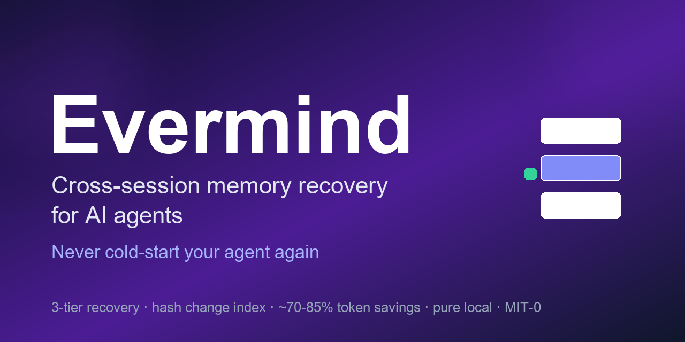
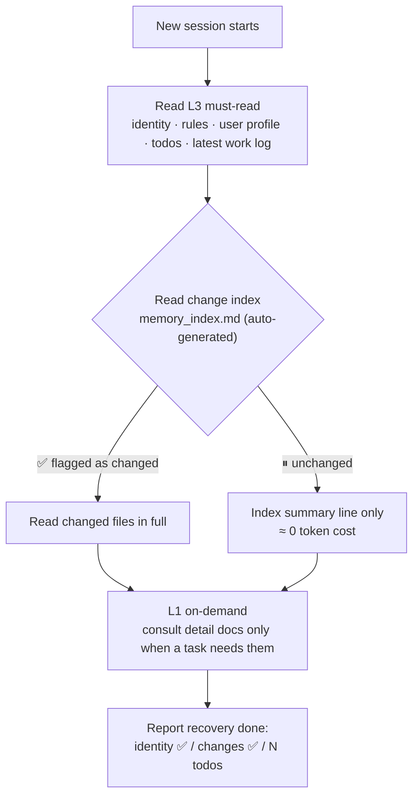

# Evermind

<p align="center">
  
</p>

**Cross-session memory recovery for AI agents. Restore state in ~70% fewer tokens — and switch contexts anytime, at any task boundary, without losing your agent's memory.**


Every new session feels like "day one at work"? Your agent doesn't know who you are, what the rules are, or where work left off — so you re-explain everything, and it still drops things.

Evermind hands your agent a **shift handover** before it starts working:

- **Always reads** the core layer — identity, rules, user profile, latest todos, latest work log (nothing important silently dropped)
- **Checks a change index** (auto-generated, hash-based) before re-reading secondary files — unchanged files cost ~0
- **Defers everything else** until it is actually needed

Measured on our own production system: recovery drops from **~44K to ~12K tokens** (~70% less). When the host already injects identity memory (e.g. Hermes), the duplicated read is skipped automatically — **~55-75% cumulative savings** (measured 2026-09-04).

### Why this changes your workflow: free context switches

Cheap, reliable recovery turns "start a new session" from a **lossy, expensive operation** into a **free, safe one**. You no longer have to stretch one session until the context breaks — you switch whenever it makes sense:

- task boundary reached? **Switch.** A fresh, clean context works better than a bloated one
- long-running project? **Switch at milestones** — each session resumes exactly where the last one left off
- context getting heavy? **Switch early** instead of waiting for compression to kick in

Every switch costs a few thousand tokens to recover instead of tens of thousands of re-explaining — so the optimal move shifts from "squeeze one session dry" to "cut at the cleanest seam". This is the pattern we run in production (dozens of sessions per day, cross-session handover as the default).

## Quick start

```bash
# 1. get the skill
git clone https://github.com/ccy123abcd/evermind-ai-agent-memory.git
cp -r evermind ~/.claude/skills/          # or your agent's skills dir

# 2. cold start (no config needed — discovery finds your layout)
cd evermind
python scripts/memory_index.py --list .   # optional: preview what discovery picks
python scripts/memory_index.py            # discover + write index (≈30s total)

# 3. (optional) tune — copy config.example.yaml → config.yaml (mode/roles/extras),
#    or edit .evermind/discovery.json to override a discovered role

# 4. self-test
python scripts/memory_index.py --demo
```

Then, at the start of each new session, instruct your agent to follow `SKILL.md` (or wire it into a session-reset hook for Hermes).

## Platform support

| Platform | How to use |
|---|---|
| **Hermes** (Nous Research) | Drop into the agent's `skills/` directory; invoke "recover memory" per session or wire SKILL.md into a session-reset hook. Hermes injects SOUL/MEMORY/USER automatically — the skill detects host-injected identity and skips duplicate reads (the 55-75% cumulative case). |
| **ClawHub / OpenClaw** | Dual-compatible frontmatter (standard + `metadata.hermes`). Install into the skills directory or via your hub client. |
| **Claude Code / Cursor / Codex** | Copy the folder into the project or agent skills directory (`~/.claude/skills/`, etc.); instruct the agent to follow SKILL.md at session start. |
| **Any LLM, any OS** | Recovery logic is pure convention + one Python stdlib script — model-agnostic; Windows / macOS / Linux; no GPU. |

## Why not just another memory plugin?

Existing memory/marketplace skills are mostly about **storing** memories. Nobody solves **cheap, reliable recovery**:

- Naive recovery = re-read everything → expensive (44K tokens per session adds up fast on API pricing)
- "Trust the model to remember" = gamble → it forgets, and you don't know what it forgot

The missing piece is a **change index**: a daily hash pass that tells the agent *what actually changed* since the last session. With it, recovery is **neither expensive nor risky**. That index is what this skill automates (`scripts/memory_index.py`, pure stdlib, ~0 cost).

## How it works



| Layer | Reads | When | Cost |
|---|---|---|---|
| **L3 Must-read** | identity / rules / user profile / latest todos / latest work log | Every new session — reliability anchor | small & fixed |
| **L2 Conditional** | secondary files (roles, members, configs) | **Only if the auto-generated index flags a change**; otherwise just the index summary line | ≈0 ← savings live here |
| **L1 On-demand** | detail docs / history | Only when actually needed | 0 |

`scripts/memory_index.py` hashes every L2-tracked file (md5 + 24h freshness window) and writes a human-readable `memory_index.md`. No index → all-or-nothing. With an index → read the few files that changed.

> Honest numbers: ~12K is our measured tiered-recovery cost vs ~44K naive (~70% less). ~55-75% cumulative is our measured range for hosts that already inject identity (the duplicate identity read is skipped). Highest-value users: heavy multi-session automation (many sessions/day).

## Configuration (optional)

Evermind works with **no config** (auto-discovery). To tune, copy `config.example.yaml` → `config.yaml`:

- `mode` — `auto` (default, discovers your layout) / `manual` (explicit paths only) / `internal` (fixed-layout)
- `roles` — semantic roles → real files: `rules` / `identity` / `todos` / `journal` / `profile` (file or directory; a directory resolves to its newest `YYYY-MM-DD.*` file)
- `must_read_extra` — extra L3 files read in full every session
- `tracked_files_extra` — extra L2 files, change-tracked (path / display name / description)

Legacy 0.2.x `must_read`/`tracked_files` keys migrate automatically (kept as L3/L2 extras). Discovery output lives in `.evermind/discovery.json` — override any role there.

Outputs: `memory_index.md` (readable) + `memory_index_state.json` (state — don't hand-edit).

## Usage protocol (start of every new session)

0. **Discover** — read `.evermind/discovery.json` (or run `python scripts/memory_index.py --discover .` on first use); stat the stored paths — any missing source triggers re-discovery. Python unavailable? Use the manual fallback list in SKILL.md.
1. Read the L3 roles + `must_read_extra` — every one, no shortcuts (host-injected identity = skip the file probe).
2. Read `memory_index.md`:
   - ✅ new change → read that file in full
   - ⏸ unchanged → index summary line only
3. Consult L1 detail docs only when a task needs them.
4. Report honestly with sources — list any role that came up empty; never claim a recovery that didn't happen.
5. Context gauge — report real usage % when the platform exposes it (Hermes `/status`, Claude Code `/context`); nudge at 50% / 70% (full table in SKILL.md).

## Repository layout

```
evermind/
├── SKILL.md                 # agent-facing instructions (progressive disclosure)
├── README.md                # this file
├── config.example.yaml      # configuration template
├── scripts/
│   └── memory_index.py      # change-index generator (pure stdlib, zero deps)
├── CHANGELOG.md
├── LICENSE                  # MIT-0
└── version
```

## Security

- Discovery scans candidate paths by name only (metadata — no content); the index reads and hashes only files you listed (roles + extras). Never writes your memory files themselves (only `.evermind/discovery.json`, index md + state json)
- Nothing leaves your machine — no remote install pipelines, no script-to-shell execution
- Python standard library only. PyYAML optional: when absent, a built-in fallback parser reads the config (nested `roles:`, extras, flat `role_*` keys) — no silent config loss

## Roadmap (managed edition)

- Auto user-profiling (preferences / habits)
- Cross-device sync + web console
- One-click deploy

**Don't want to self-configure?** The managed edition = zero-setup, full system, continuous updates. → [Managed edition: TBD]

## License

MIT-0 — free to use, modify, and sell.

---

*Crafted by 天玄镜 (Evermind) · TXJ system*  

⭐ Found this useful? Star the repo — it helps others find it. Found a bug? [Open an issue](https://github.com/ccy123abcd/evermind-ai-agent-memory/issues).
